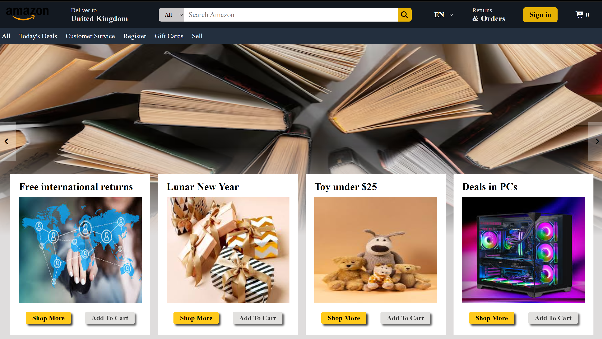

# Amazon Clone

A responsive e-commerce website inspired by Amazon, built to practice modern frontend development and user interface design.

## Preview

## Features

- Responsive design
- Product browsing
- Product cards and categories
- Shopping cart interface
- Clean and user-friendly layout

## Technologies

HTML · CSS · JavaScript

## Author

**Tyobsta Wodaj**
